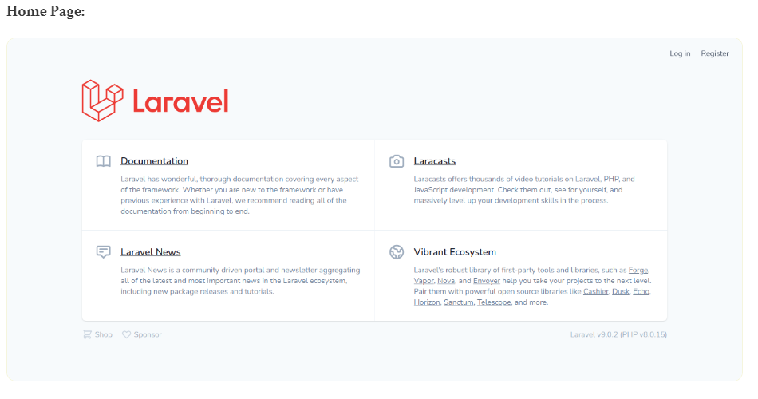
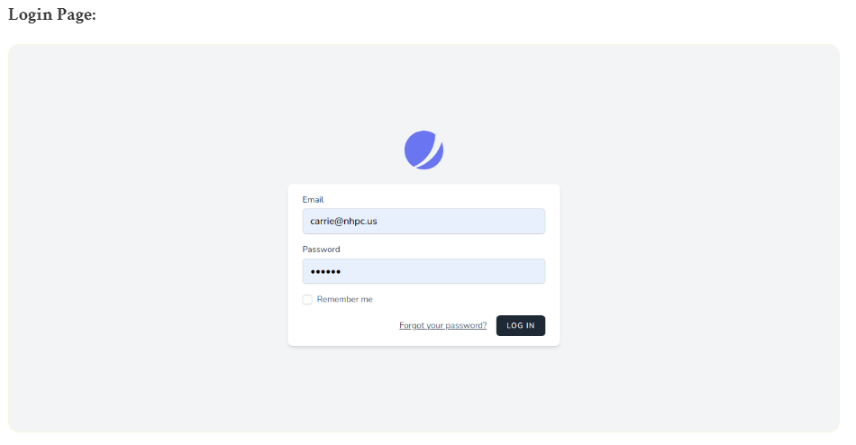
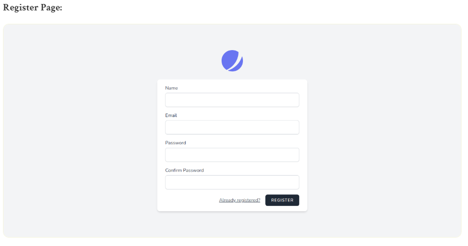
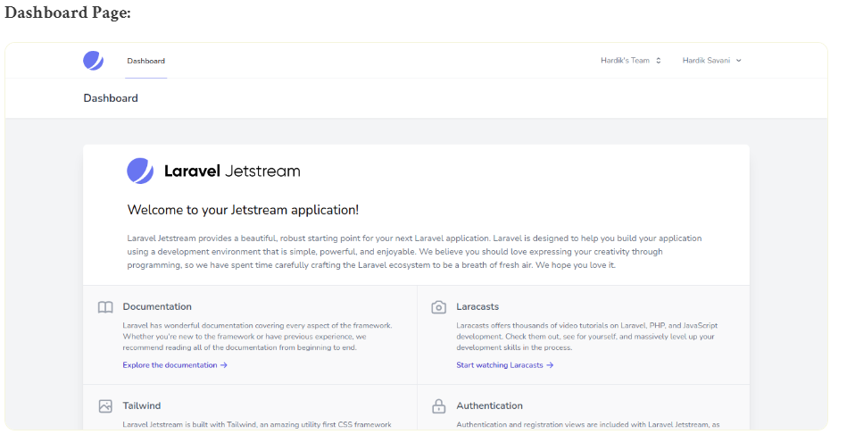
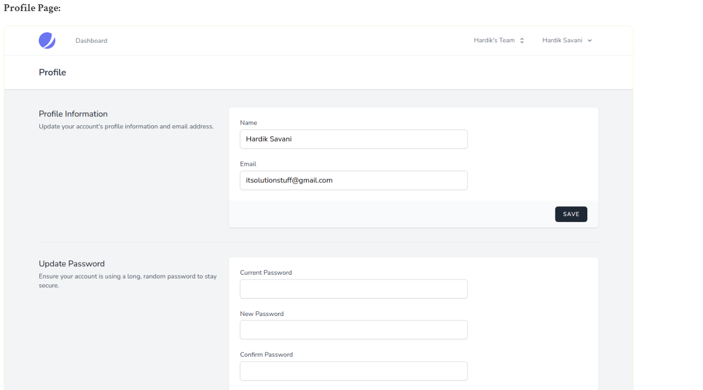
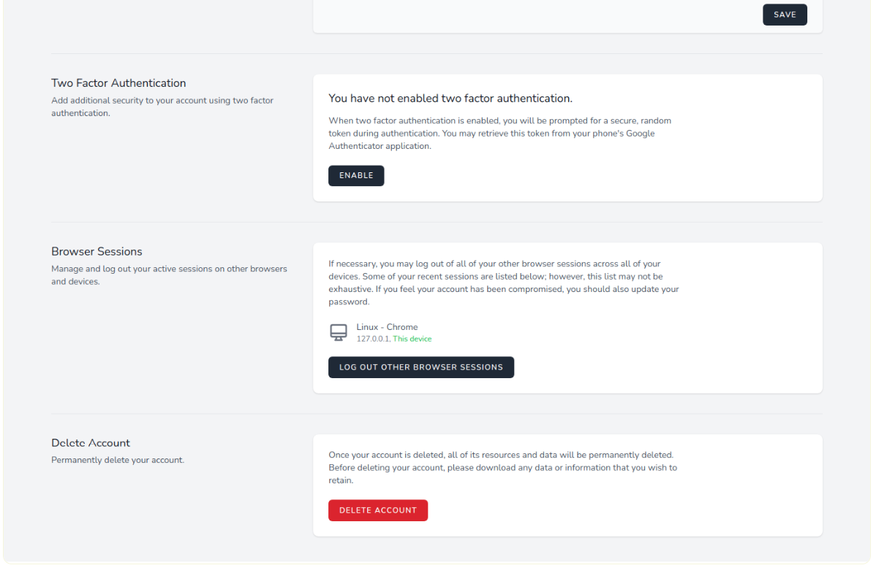
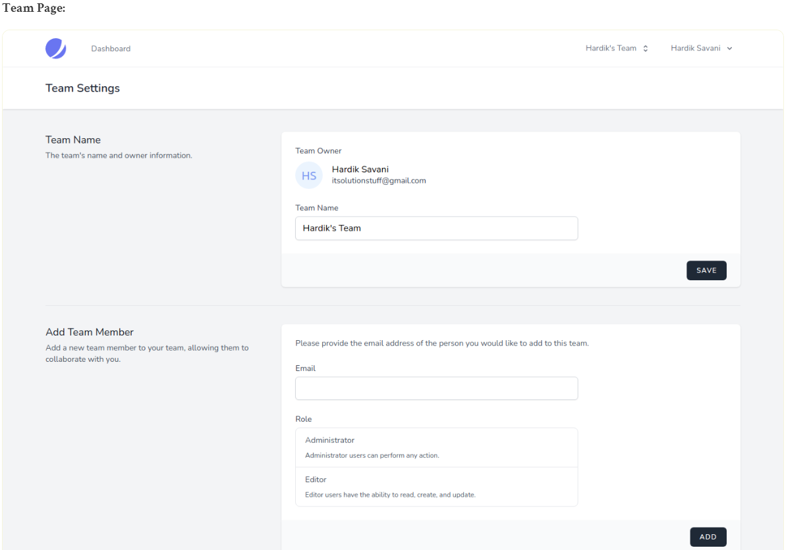

# laravel9_auth_with_inertia_js_jetstream

## 1. Install Laravel 9
```Dockerfile
composer create-project laravel/laravel laravel9_auth_with_inertia_js_jetstream
```
## 2. Install Jetstream:
```Dockerfile
composer require laravel/jetstream
```
- Create Auth with Inertia:
```Dockerfile
php artisan jetstream:install inertia
OR
php artisan jetstream:install inertia --teams
```
- Dùng node js package (Cài Node.js) 
```Dockerfile
npm install
```
- run package
```Dockerfile
npm run dev
```
- run create database table
```Dockerfile
php artisan migrate
```
- Vào config/fortify.php
```Dockerfile
....
  
'features' => [
        Features::registration(),
        Features::resetPasswords(),
        Features::emailVerification(),
        Features::updateProfileInformation(),
        Features::updatePasswords(),
        Features::twoFactorAuthentication(),
    ],
...
```
- Vào config/jetstream.php
```Dockerfile
....
  
'features' => [
        Features::profilePhotos(),
        Features::api(),
        Features::teams(),
    ],
...
```
# Run Laravel App:
```Dockerfile
php artisan serve
```
- Vào 
http://localhost:8000/








